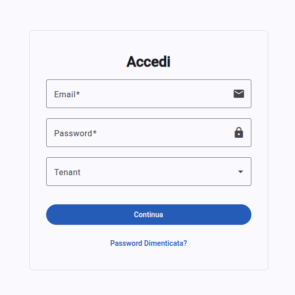
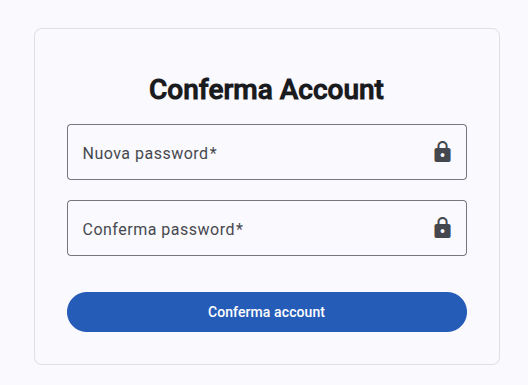
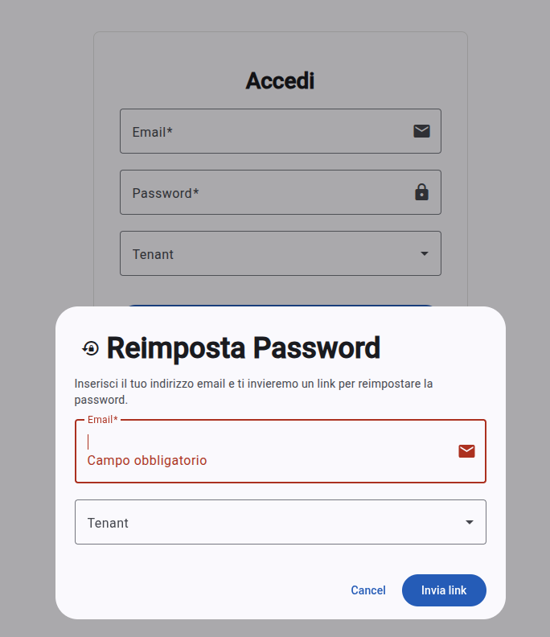
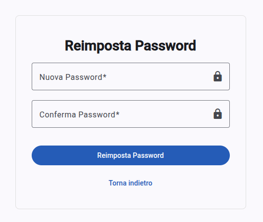
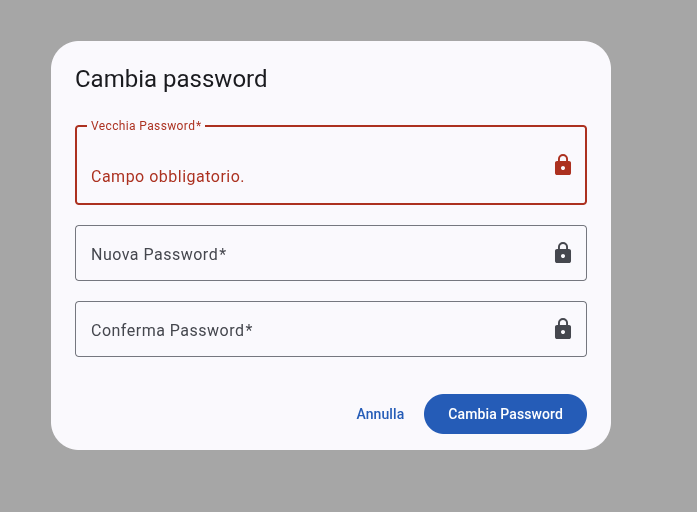
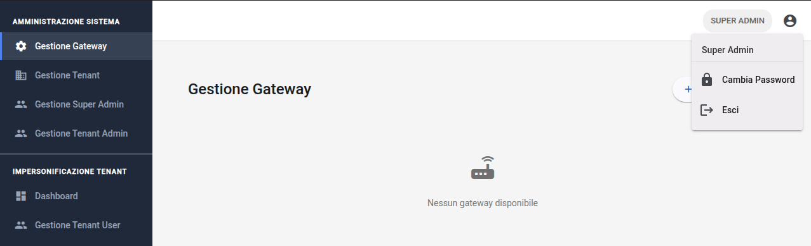

# Accesso e autenticazione <!--raw-typst <dashboard-frontend> -->
Il sistema adotta un modello di sicurezza robusto basato su JWT{{gloss}} (JSON Web Token) per garantire l'integrità delle sessioni e la segregazione dei dati tra i diversi tenant{{gloss}}. L'accesso è regolato da una gerarchia di permessi che definisce le funzionalità visibili all'utente (Super Admin, Tenant Admin o Tenant User) all'interno dell'interfaccia.

## Login al sistema
La procedura di autenticazione standard consente agli utenti già registrati di accedere al proprio ambiente operativo. La richiesta di login prevede l'invio di credenziali verso le API{{gloss}} di autenticazione che, in caso di successo, restituiscono un token JWT contenente l'identità e il ruolo dell'utente.

### Procedura di login
Per effettuare l'accesso, l'utente deve interagire con la form del login inserendo i seguenti parametri:

- **Email**: l'email associato al profilo;
- **Password**: la password definita in fase di attivazione;
- **Tenant**: tramite un menù a tendina che permette di indicare il tenant di riferimento.

**Nota per i Super Admin**: Gli utenti con privilegi di amministratore globale possono effettuare il login senza selezionare un tenant specifico per accedere alla gestione anagrafica generale; la visualizzazione dei dati operativi (dashboard) richiederà successivamente una procedura di impersonificazione{{gloss}}.

## Conferma account e attivazione
L'attivazione di un nuovo profilo è un passaggio che avviene a seguito della creazione dell'utente da parte di un amministratore.

### Procedura di attivazione
Il flusso di attivazione prevede i seguenti step:

- **Ricezione invito**: l'utente riceve un'email (intercettabile tramite tool come #gloss("Mailtrap") in ambiente di test) contenente un link di attivazione univoco.
- **Accesso alla pagina**: cliccando sul link, l'utente arriva sulla pagina di **conferma** dell'account, che estrae automaticamente il **token** e il **tenantId** dai parametri dell'URL.
- **Impostazione credenziali**: l'utente deve definire la propria password tramite il form della conferma account.
   - La password deve essere lunga almeno 8 caratteri;
   - Il sistema convalida in tempo reale che la password di conferma coincida con quella inserita.
- **Finalizzazione**: al clic su "Conferma account", il sistema crea le credenziali, inizializza lo schema nel database e logga automaticamente l'utente, reindirizzandolo alla dashboard.

## Recupero credenziali
In caso di smarrimento della password, il sistema offre un flusso di ripristino basato su token temporanei.

### Richiesta di reimpostazione password
Attraverso la finestra di dialogo dedicata, l'utente può richiedere il reset inserendo la propria email e selezionando il tenant di riferimento. Se i dati corrispondono a un utente attivo, viene inviato un link di ripristino via email.

### Reimpostazione password
Il link ricevuto conduce alla pagina di **reset** della password. L'utente deve:

- Inserire la nuova password rispettando i requisiti di sicurezza (minimo 8 caratteri);
- Confermare l'operazione. Una volta completata, l'interfaccia mostrerà un messaggio di successo e consentirà di tornare alla pagina di login per accedere con le nuove credenziali.

## Gestione sessione e sicurezza interna
Dopo l'accesso, l'utente ha a disposizione strumenti per mantenere la sicurezza del proprio account direttamente dall'interfaccia principale.

### Cambio password in sessione
È possibile aggiornare la password mentre si è autenticati aprendo la finestra di dialogo apposito dal menu utente:

- È obbligatorio inserire la **vecchia password** per validare l'identità dell'utente prima della modifica;
- Il sistema invia una richiesta che aggiorna le credenziali nel database senza interrompere la sessione corrente.

### Impersonificazione (solo Super Admin)
Il ruolo Super Admin dispone della funzionalità di impersonificazione per supportare i diversi tenant:

- Dalla sezione "Gestione Tenant", cliccando sull'icona della dashboard, il sistema aggiunge il parametro `tenantId` all'URL della dashboard;
- La dashboard visualizzerà un banner informativo indicando il nome dell'organizzazione attualmente "impersonata";
- Questa modalità permette di visualizzare sensori e gateway specifici di quel tenant come se si fosse un amministratore locale.

### Logout
L'azione di logout, disponibile nell'`header`, garantisce la chiusura sicura della sessione. Il comando esegue le seguenti azioni:

- Pulizia dello stato dell'utente e delle sue informazioni;
- Reindirizzamento immediato alla pagina di login, impedendo l'accesso alle rotte protette.

