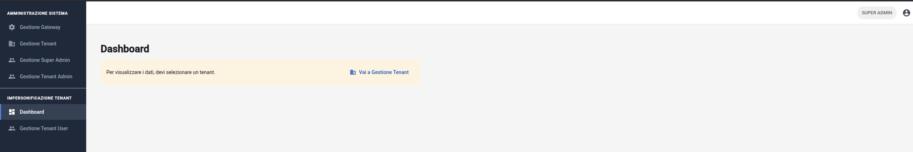
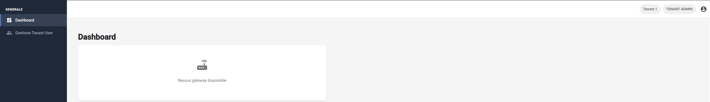

# Interfaccia principale
L'interfaccia utente è costruita attorno a un componente di layout fisso denominato, che definisce la struttura globale della piattaforma e garantisce una navigazione coerente tra i vari moduli operativi.

## Layout globale
Il layout è diviso in due macro-aree principali:
1. **Navigazione laterale**: una barra fissa a sinistra che ospita i collegamenti alle funzionalità di sistema.
2. **Contenuto principale**: l'area centrale dove vengono caricati dinamicamente i moduli (Dashboard, Gestione Gateway, etc.) e che include nella parte superiore la barra degli strumenti (**header**).

## Barra di navigazione
La **`side-bar`** permette all'utente di spostarsi tra le diverse aree della piattaforma in base ai propri permessi di accesso.

### Gestione delle voci di menu
La lista dei collegamenti è generata dinamicamente.
- **Accesso condizionale**: ogni voce viene visualizzata solo se il sistema conferma che l'utente possiede i permessi richiesti.
- **Organizzazione visiva** (solo per i Super Admin): il menu ha due titoli utili per raggruppare visivamente l'area generica dall'area dedicata all'impersonificazione.
- **Feedback di navigazione**: la pagina attualmente visualizzata è evidenziata nel menu.

_Figura 7: Dashboard di un Super Admin._

_Figura 8: Dashboard di un Tenant Admin._

## Barra degli strumenti
L'**`header`** posizionato nella parte superiore fornisce informazioni contestuali sulla sessione e l'identità dell'utente loggato.

### Indicatori di stato e identità
All'interno della barra vengono mostrati i seguenti elementi:
- **Badge del tenant**: mostra il nome del tenant a cui l'utente appartiene attualmente. Nel caso di un Super Admin non c'è niente.
- **Badge del ruolo**: indica il livello gerarchico dell'account (Super Admin, Tenant Admin o Tenant User).
- **Identificativo utente**: il nome dell'utente è visualizzato all'interno del menu a comparsa attivabile dall'icona del profilo.

## Azioni globali e gestione account
Attraverso l'icona del profilo nell'header, l'utente può accedere a funzioni trasversali per la gestione della propria utenza.

### Cambia password
Selezionando la voce "Cambia Password", il sistema apre la finestra di dialogo dedicata. 
- L'utente deve inserire la password corrente per validare l'operazione, seguita dalla nuova password.
- In caso di successo, un messaggio di notifica conferma l'aggiornamento senza richiedere un nuovo login.

### Logout
L'azione di uscita termina la sessione di lavoro corrente.
L'utente viene immediatamente reindirizzato alla pagina di login, garantendo che nessuna informazione sensibile rimanga accessibile nel browser.