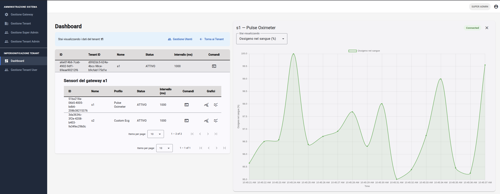
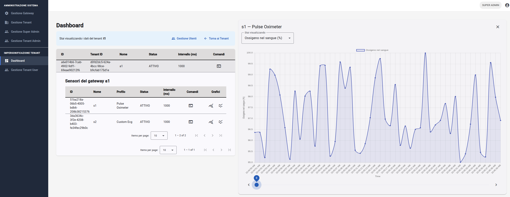
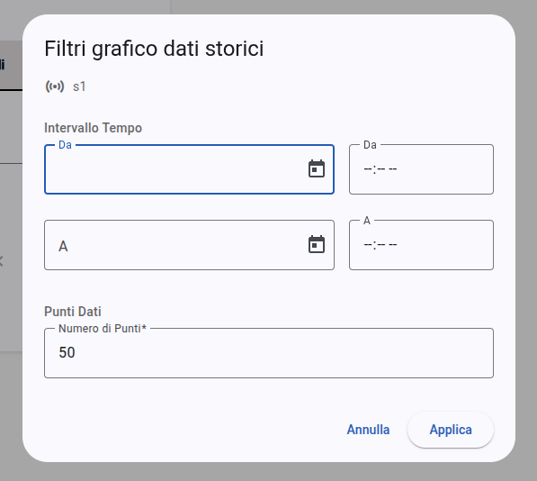

# Dashboard e monitoraggio
La **`dashboard`** rappresenta il nucleo operativo dell'applicazione, progettata per fornire una supervisione centralizzata dei dispositivi e un'analisi dettagliata dei dati biometrici e ambientali (dati dai sensori BLE). L'interfaccia è suddivisa in un'area di controllo dei gateway e dei rispettivi sensori (sinistra) e un'area di visualizzazione grafica (destra) che si attiva dinamicamente su richiesta dell'utente (pulsanti posizionati in ogni sensore).

## Visualizzazione dispositivi e stato
Il sistema organizza i dispositivi in una gerarchia logica che riflette l'architettura fisica della rete di sensori.

### Esplorazione dei gateway e dei sensori
L'utente può interagire con le tabelle per navigare tra le entità del proprio **tenant**:
- **Espansione gateway**: cliccando sulla riga di un gateway nella tabella dei gateway, il sistema espande una sezione nidificata che mostra l'elenco dei sensori Bluetooth attualmente associati.
- **Indicatori di stato**: Ogni dispositivo mostra un badge colorato che ne indica lo stato operativo (attivo, inattivo e decomissionato). 
- **Filtri ruolo** (solo per i Super Admin): la dashboard permette di visualizzare i dati di un tenant specifico attraverso la procedura di impersonificazione{{gloss}} (cliccando il pulsante accanto al tenant desiderato nella sezione "Gestione Tenant"), mostrando un banner di avviso in cima alla pagina.

## Monitoraggio analitico 
Il monitoraggio dei segnali avviene attraverso il **#gloss("chart-container")**{{gloss}}, che gestisce il ciclo di vita dei grafici e la comunicazione con il **#gloss("sensor-chart-service")**{{gloss}}.

### Grafici in tempo reale
Attivabile tramite l'icona `ssid_chart` nella tabella sensori, questa modalità apre uno stream di dati continuo.
- **Connessione**: lo stato della connessione (es. "Connected" o "Reconnecting") è sempre visibile nell'intestazione a destra del grafico.
- **Selezione campi**: se un sensore invia più parametri (es. sensore ambientale con temperatura e umidità), l'utente può selezionare quale dato visualizzare tramite un menu a tendina integrato.

_Figura 9: Visualizzazione grafico con dati real time._

### Grafici storici
Attivabile tramite l'icona `query_stats`, permette di analizzare le letture memorizzate nel database.
- **Configurazione filtri**: l'apertura del grafico richiede l'interazione con la finestra di dialogo dedicata, dove l'utente definisce l'intervallo temporale e il numero di punti (limite massimo 300).
- **Navigazione temporale**: il grafico contenente dati storici include, quando il numero di punti eccede la finestra di visualizzazione predefinita, uno slider inferiore e pulsanti di scorrimento per spostarsi all'interno del dataset recuperato.

_Figura 10: Visualizzazione grafico con dati storici._

_Figura 11: Form dei filtri sui dati storici._

## Invio comandi ai dispositivi
Dalla dashboard è possibile interagire direttamente con i dispositivi per modificarne il comportamento operativo in tempo reale tramite l'invio di comandi.

Per maggiori informazioni si rimanda alla sezione "Gestione Gateway e Sensor" del presente Manuale Utente.