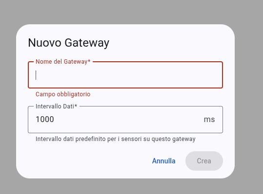
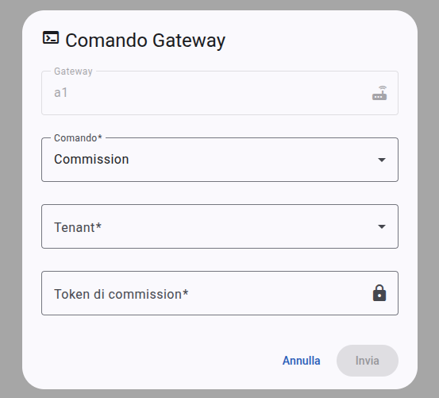
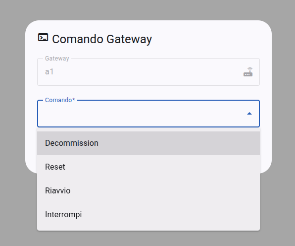
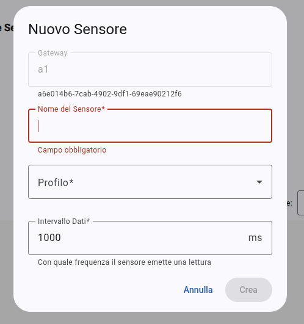
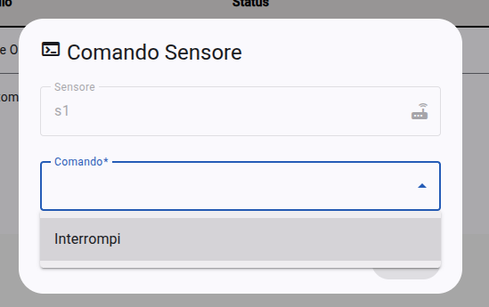

# Gestione Gateway e Sensor
Il modulo di gestione dei **gateway** e dei *sensori* è l'ambiente dedicato all'amministrazione hardware del sistema. In questa sezione, gli utenti autorizzati possono censire nuovi dispositivi, configurarne i parametri operativi e gestire il loro intero ciclo di vita.

## Operazioni sui gateway
I gateway fungono da concentratori per i sensori Bluetooth; la loro corretta configurazione è fondamentale per garantire il flusso dati verso il backend.

_Figura 12: Sezione dedicata alla gestione dei gateway._

### Aggiunta nuovo gateway
Per inserire un nuovo gateway nel sistema, l'utente deve inserire nella finestra dialogo apposita:
1. **Nome**: definire un'etichetta descrittiva per identificare il dispositivo.
2. **Intervallo dati**: impostare la frequenza di comunicazione predefinita in millisecondi. Il sistema impone un limite minimo di **100ms** per salvaguardare la stabilità della rete.

_Figura 13: Form di creazione di un nuovo gateway._

_Figura 14: Finestra di dialogo di eliminazione di un gateway._

### Comandi operativi e manutenzione
Cliccando sull'icona `terminal` all'interno della tabella dei gateway, si apre la finestra di dialogo dei comandi del gateway:
- **Commissioning**: associa un gateway simulato al tenant specificato.
- **Manutenzione**: permette l'invio di istruzioni specifiche quali:
  - **Reboot**: riavvia il gateway;
  - **Reset**: ripristina le impostazioni di fabbrica del dispositivo;
  - **Interrupt**: sospende temporaneamente l'invio dei dati dei sensori associati;
  - **Resume**: riprende la trasmissione dei dati dopo un'interruzione.

_Figura 15: Form di commissioning di un gateway._

_Figura 16: Form dei comandi di un gateway mentre è attivo._

_Figura 17: Form dei comandi di un gateway mentre è inattivo._

### Gestione delle chiavi pubbliche
In modalità di gestione, la tabella mostra la **#gloss("Public Key")**{{gloss}} di ogni dispositivo. L'interfaccia mette a disposizione un pulsante di copia rapida per acquisire l'identificativo, necessario per la generazione dei token di commissioning tramite i tool del container `nats-manager`.

## Operazioni sui sensori
I sensori vengono gestiti e configurati all'interno del contesto del gateway a cui sono associati.

### Creazione e associazione
Per aggiungere un sensore, è necessario espandere la riga del gateway di riferimento e cliccare su **"Nuovo Sensore"**, attivando la finestra di dialogo dedicata. I parametri di configurazione richiesti sono:
- **Nome**: identificativo testuale del sensore.
- **Profilo**: selezione della tipologia di sensore tramite il menù a tendina.
- **Intervallo dati**: specifica la frequenza (in ms) con cui il sensore deve campionare ed emettere una lettura.

_Figura 18: Form di creazione di un nuovo sensore._

_Figura 19: Finestra di dialogo di eliminazione di un sensore._

### Controllo del campionamento
Dalla tabella sensori è possibile gestire l'attivazione dei singoli dispositivi Bluetooth tramite la finestra di dialogo apposita:
- **Interrupt**: sospende il campionamento e l'invio delle letture per lo specifico sensore senza influenzare gli altri dispositivi collegati al medesimo gateway.
- **Resume**: riattiva il flusso dati verso il gateway e la dashboard.

_Figura 20: Form dei comandi di un sensore mentre è attivo._

_Figura 21: Form dei comandi di un sensore mentre è inattivo._

L'esito di ogni operazione di creazione o eliminazione viene confermato all'utente tramite una notifica.