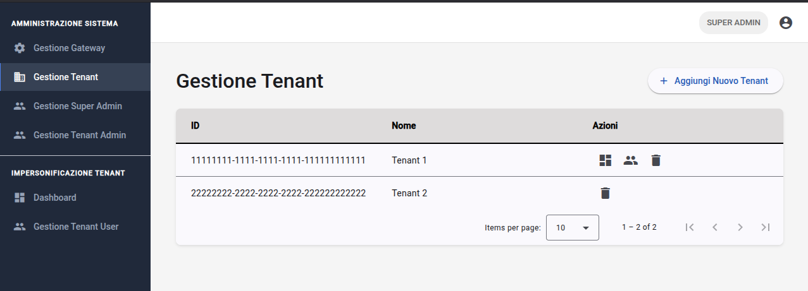
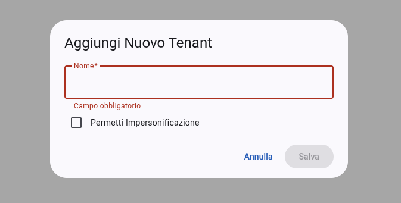
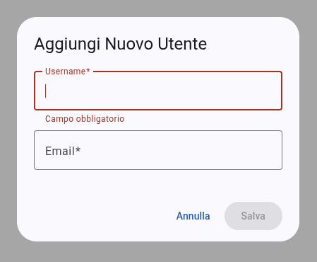
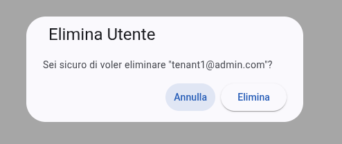

# Amministrazione di sistema
Le funzionalità di amministrazione sono riservate agli utenti con privilegi elevati (Super Admin e Tenant Admin) e consentono la gestione delle entità fondamentali che compongono l'ecosistema multi-tenant.

## Gestione tenant
Il modulo di **gestione tenant** permette ai Super Admin di amministrare le organizzazioni censite nel sistema.

### Configurazione e creazione
Attraverso la finestra di dialogo dedicata, è possibile aggiungere nuove organizzazioni definendo:

- **Nome**: identificativo univoco del tenant;
- **Permesso di impersonificazione**: tramite il checkbox `canImpersonate`, l'amministratore abilita o disabilita la possibilità per i Super Admin di accedere ai dati operativi di quel tenant.

### Impersonificazione e navigazione contestuale
La **tabella** di gestione espone le azioni specifiche per ogni tenant:

- **Accesso dashboard**: Cliccando sull'icona `dashboard`, il Super Admin "entra" nell'ambiente del tenant selezionato. Il sistema aggiunge il `tenantId` ai parametri di ricerca dell'URL per filtrare gateway e sensori.
- **Gestione utenti tenant**: l'icona `people` reindirizza direttamente alla gestione degli utenti specifica per quel tenant.

## Gestione utenti
Il modulo di **gestione utenti** gestisce l'anagrafica degli account, supportando flussi di lavoro diversi per Super Admin e Tenant Admin.

### Creazione e invito
La creazione di un utente non prevede l'impostazione immediata di una password, ma attiva un processo di invito:

- L'amministratore inserisce `username` ed `email` nel form di creazione.
- Se il ruolo creato è `TENANT_ADMIN` o `TENANT_USER`, è necessario associare l'utente a un tenant (campo bloccato se si opera già nel contesto di un tenant specifico).
- Al salvataggio, il sistema invia un'email di attivazione (verificabile su MailTrap{{gloss}} in ambiente di test).

### Filtri e tabella utenti
L'interfaccia si adatta dinamicamente per mostrare i dati pertinenti:

- **Tab ruoli**: permette di commutare rapidamente tra la lista dei "Tenant User" e dei "Tenant Admin".
- **Selezione tenant**: i Super Admin dispongono di un menu a tendina per filtrare la lista utenti in base all'organizzazione di appartenenza.
- **Sicurezza**: nella tabella degli utenti, il sistema inibisce automaticamente il pulsante di eliminazione per l'utente correntemente loggato, impedendo l'auto-cancellazione accidentale del proprio profilo.

