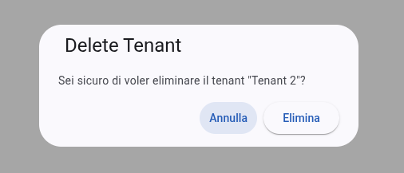
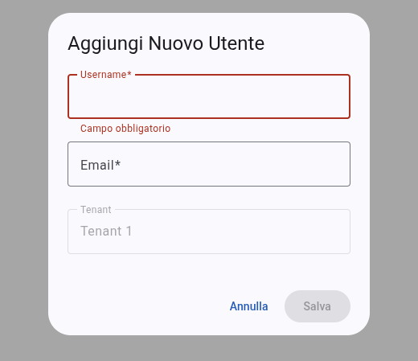
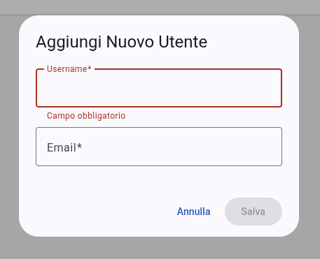
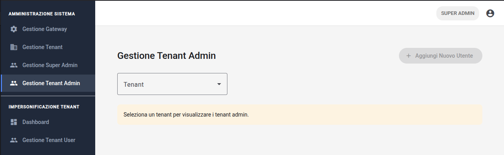
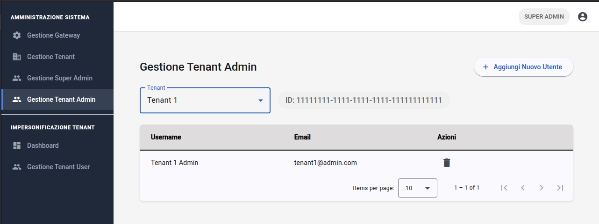

# Amministrazione di Sistema
Le funzionalità di amministrazione sono riservate agli utenti con privilegi elevati (Super Admin e Tenant Admin) e consentono la gestione delle entità fondamentali che compongono l'ecosistema multi-tenant.

## Gestione tenant (Tenant Management)
Il modulo **#gloss("Tenant Manager")**{{gloss}} permette ai Super Admin di amministrare le organizzazioni censite nel sistema.

_Figura 22: Sezione dedicata alla gestione dei tenant._

### Configurazione e creazione
Attraverso la finestra di dialogo dedicata, è possibile aggiungere nuove organizzazioni definendo:
- **Nome**: identificativo univoco del tenant;
- **Permesso di impersonificazione**: tramite il checkbox `canImpersonate`, l'amministratore abilita o disabilita la possibilità per i Super Admin di accedere ai dati operativi di quel tenant.

_Figura 23: Form di creazione di un nuovo Tenant._

_Figura 24: Finestra di dialogo di eliminazione di un Tenant._

### Impersonificazione e navigazione contestuale
La **#gloss("tenant-table")**{{gloss}} espone azioni specifiche per ogni organizzazione:
- **Accesso dashboard**: Cliccando sull'icona `dashboard`, il Super Admin "entra" nell'ambiente del tenant selezionato. Il sistema aggiunge il `tenantId` ai parametri di ricerca dell'URL per filtrare gateway e sensori.
- **Gestione utenti tenant**: l'icona `people` reindirizza direttamente alla gestione degli utenti specifica per quel tenant.

## Gestione utenti (User Management)
Il modulo **#gloss("User Manager")**{{gloss}} gestisce l'anagrafica degli account, supportando flussi di lavoro diversi per Super Admin e Tenant Admin.

### Creazione e invito
La creazione di un utente non prevede l'impostazione immediata di una password, ma attiva un processo di invito:
1. L'amministratore inserisce `username` ed `email` nel form di creazione.
2. Se il ruolo creato è `TENANT_ADMIN` o `TENANT_USER`, è necessario associare l'utente a un tenant (campo bloccato se si opera già nel contesto di un tenant specifico).
3. Al salvataggio, il sistema invia un'email di attivazione (verificabile su **#gloss("Mailtrap")**{{gloss}} in ambiente di test).

_Figura 25: Form di creazione di un nuovo Super Admin._

_Figura 26: Form di creazione di un nuovo Tenant Admin._

_Figura 27: Form di creazione di un nuovo Tenant User._

_Figura 28: Finestra di dialogo di eliminazione di un Tenant Admin._

### Filtri e tabella utenti
L'interfaccia si adatta dinamicamente per mostrare i dati pertinenti:
- **Tab ruoli**: permette di commutare rapidamente tra la lista dei "Tenant User" e dei "Tenant Admin".
- **Selezione tenant**: i Super Admin dispongono di un menu a tendina per filtrare la lista utenti in base all'organizzazione di appartenenza.
- **Sicurezza**: nella tabella degli utenti, il sistema inibisce automaticamente il pulsante di eliminazione per l'utente correntemente loggato, impedendo l'auto-cancellazione accidentale del proprio profilo.

_Figura 29: Sezione dedicata alla gestione dei Tenant Admin._

_Figura 30: Sezione dedicata alla gestione dei Tenant Admin con tenant selezionato._