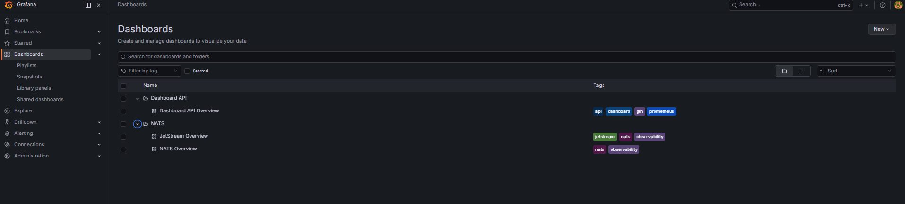
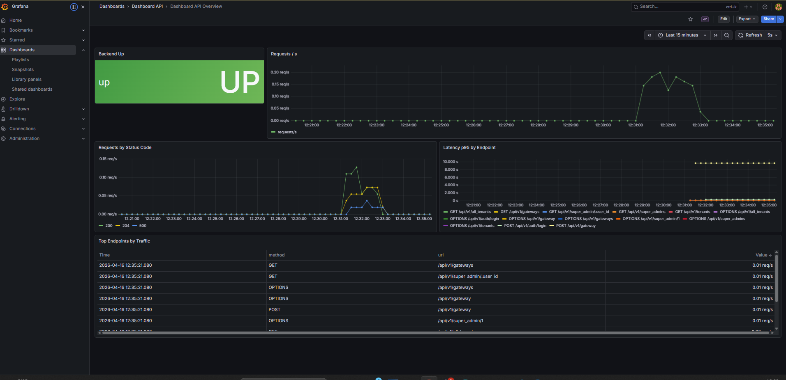
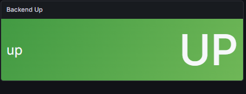
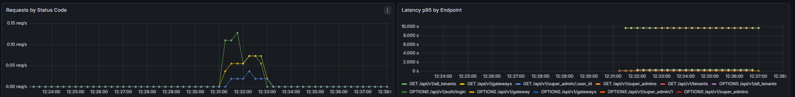
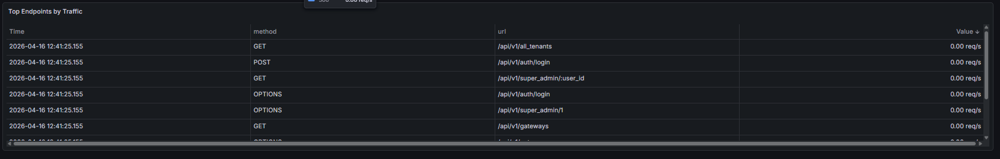

# Metriche del backend

Questa pagina descrive come leggere e interpretare la dashboard **Dashboard API Overview** di Grafana{{gloss}}, che monitora lo stato e le prestazioni del microservizio Dashboard.

Per accedere alla dashboard, aprire Grafana{{gloss}} all'indirizzo `http://localhost:3000`, navigare su **Dashboards** dal menu laterale e selezionare **Dashboard API Overview** dalla cartella **Dashboard API**.

## Panoramica della dashboard

La dashboard mostra in un'unica schermata lo stato del servizio, il traffico HTTP e le prestazioni degli endpoint.

## Backend Up

Il pannello **Backend Up** indica se il microservizio Dashboard è operativo. Mostra il valore `UP` su sfondo verde quando il servizio è raggiungibile, oppure `DOWN` su sfondo rosso in caso di anomalia.

## Richieste per codice di stato e latenza

Il pannello **Requests by Status Code** mostra il numero di richieste HTTP al secondo ricevute dal backend, suddivise per codice di risposta (2xx, 4xx, 5xx). Permette di identificare rapidamente eventuali picchi di errori.

Il pannello **Latency p95 by Endpoint** mostra il tempo di risposta al 95° percentile per ciascun endpoint e metodo HTTP. Un valore elevato su un endpoint specifico indica un possibile collo di bottiglia.

## Top Endpoints by Traffic

La tabella **Top Endpoints by Traffic** elenca gli endpoint più chiamati nell'ultimo intervallo di tempo, con metodo HTTP, percorso URL e volume di traffico in richieste al secondo. È utile per identificare le parti del sistema sotto maggior carico.

