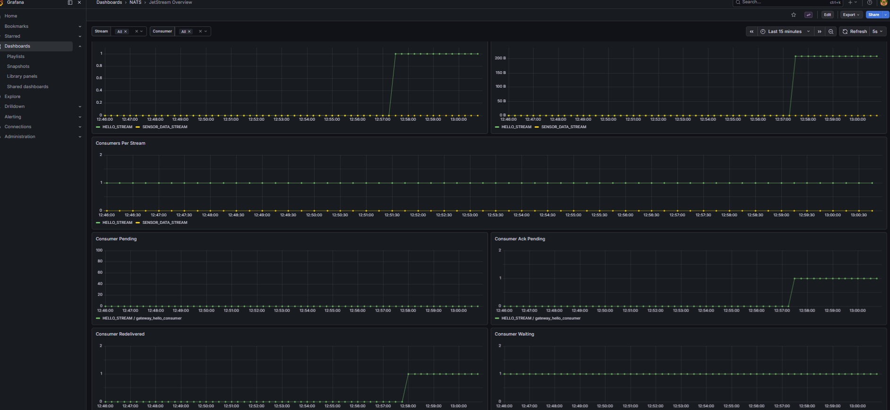
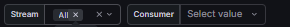
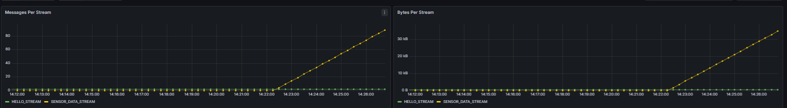
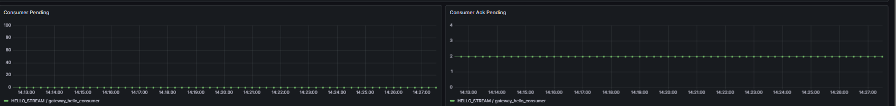
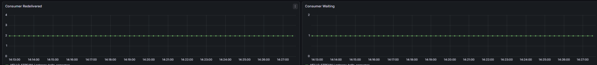

# Metriche di JetStream

Questa pagina descrive come leggere e interpretare la dashboard **JetStream Overview** di Grafana{{gloss}}, che monitora gli stream e i consumer di NATS JetStream{{gloss}}.

Per accedere alla dashboard, aprire Grafana{{gloss}} all'indirizzo `http://localhost:3000`, navigare su **Dashboards** dal menu laterale e selezionare **JetStream Overview** dalla cartella **NATS**.

## Panoramica della dashboard

La dashboard mostra le metriche degli stream e dei consumer attivi nel sistema. Nel sistema sono presenti due stream principali: `HELLO_STREAM`, utilizzato per i messaggi di handshake dei gateway, e `SENSOR_DATA_STREAM`, utilizzato per i dati provenienti dai sensori.

## Filtri per stream e consumer

In cima alla dashboard sono presenti due menu a tendina che permettono di filtrare i dati visualizzati:

- **Stream** — filtra i pannelli per uno o più stream specifici
- **Consumer** — filtra i pannelli per uno o più consumer specifici, dipendente dallo stream selezionato

Di default entrambi i filtri mostrano tutti i valori disponibili.

## Metriche degli stream

I pannelli **Messages Per Stream** e **Bytes Per Stream** mostrano rispettivamente il numero totale di messaggi e la dimensione complessiva dei dati accumulati in ciascuno stream nel tempo.

Una crescita costante indica che i messaggi vengono prodotti regolarmente. Un plateau prolungato può indicare che nessun nuovo messaggio viene pubblicato sullo stream.

## Consumer Pending e Consumer Ack Pending

Il pannello **Consumer Pending** mostra il numero di messaggi presenti nello stream che non sono ancora stati consegnati al consumer. Un valore elevato e in crescita indica che il consumer non riesce a stare al passo con la produzione.

Il pannello **Consumer Ack Pending** mostra il numero di messaggi già consegnati al consumer ma in attesa di conferma (acknowledgment). Un valore persistentemente alto può indicare un problema di elaborazione lato consumer.

## Consumer Redelivered e Consumer Waiting

Il pannello **Consumer Redelivered** mostra il numero di messaggi che sono stati riconsegnati al consumer perché la conferma non è arrivata entro il timeout. Un valore in crescita segnala instabilità nell'elaborazione dei messaggi.

Il pannello **Consumer Waiting** mostra il numero di richieste di fetch in attesa da parte del consumer. Un valore maggiore di zero indica che il consumer sta aspettando attivamente nuovi messaggi.

