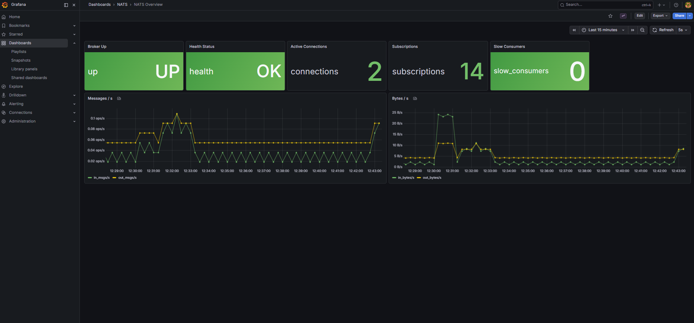
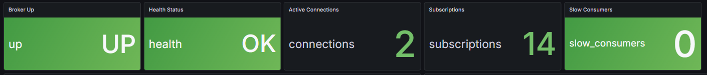
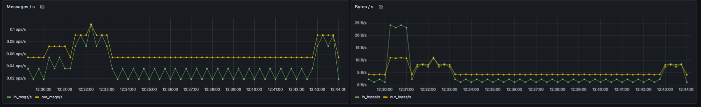

# Metriche di NATS

Questa pagina descrive come leggere e interpretare la dashboard **NATS Overview** di Grafana{{gloss}}, che monitora lo stato del broker di messaggistica NATS{{gloss}}.

Per accedere alla dashboard, aprire Grafana{{gloss}} all'indirizzo `http://localhost:3000`, navigare su **Dashboards** dal menu laterale e selezionare **NATS Overview** dalla cartella **NATS**.

## Panoramica della dashboard

La dashboard è divisa in due sezioni: una riga di pannelli stat in alto con i valori chiave in tempo reale, e due grafici in basso che mostrano il throughput nel tempo.

## Pannelli di stato

La riga superiore contiene cinque indicatori che mostrano lo stato attuale del broker NATS{{gloss}}:

| Pannello | Descrizione |
|---|---|
| **Broker Up** | Indica se il broker NATS{{gloss}} è operativo (`UP`) o non raggiungibile (`DOWN`) |
| **Health Status** | Mostra l'esito dell'health check interno del broker (`OK` o non `OK`) |
| **Active Connections** | Numero di client attualmente connessi al broker |
| **Subscriptions** | Numero totale di sottoscrizioni attive su tutti i client |
| **Slow Consumers** | Numero di consumer lenti, ovvero client che non riescono a consumare i messaggi alla velocità di produzione. Il valore ideale è `0` |

## Throughput messaggi e bytes

I grafici **Messages / s** e **Bytes / s** mostrano rispettivamente il numero di messaggi e il volume di dati transitati attraverso il broker NATS{{gloss}} per unità di tempo.

Ogni grafico presenta due serie:
- **in** — dati in ingresso al broker (prodotti dai publisher)
- **out** — dati in uscita dal broker (consegnati ai subscriber)

Un disallineamento persistente tra le due serie può indicare consumer lenti o code in accumulo.

